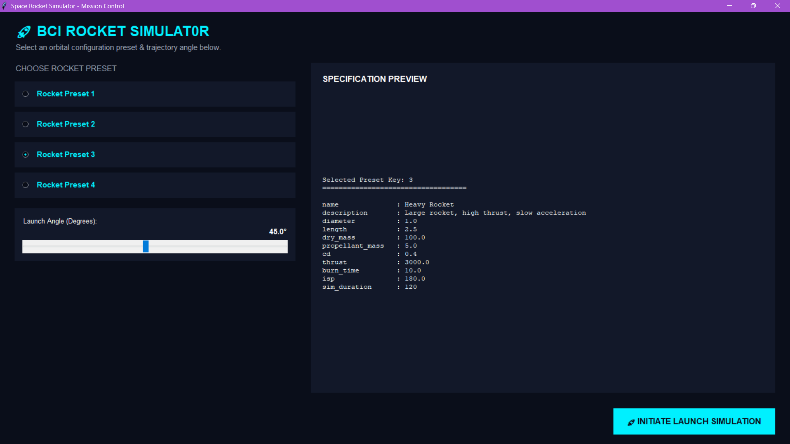
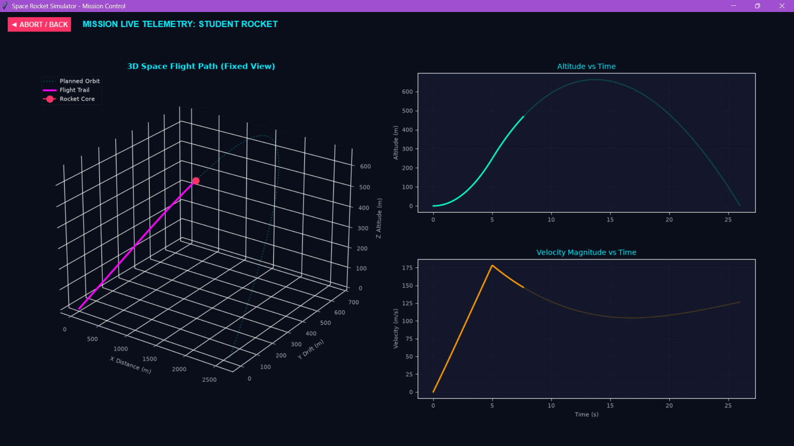

#                                                       🚀 Rocket Flight Simulator 🚀

> A Python-based rocket flight simulation application with an interactive graphical user interface and edit structure.

##  About the Project

**Rocket Flight Simulator** is a Python application that simulates the flight of different types of rockets.

Users can select a rocket preset, adjust the launch angle, launch the rocket, and analyze the flight using animation and graphical data.

The simulator provides important flight information including **maximum apogee, flight time, trajectory, altitude, and velocity components**.

---

##  Features

*  Choose from multiple rocket presets
*  Adjust the rocket launch angle
*  Animated rocket flight visualization
*  Flight trajectory graph
*  Maximum apogee calculation
*  Total flight time calculation
*  Altitude vs Time graph
*  Velocity vs Time graph
*  Horizontal velocity (**Vx**) visualization
*  Vertical velocity (**Vy**) visualization
*  Interactive and user-friendly GUI

---

#  Application Preview

##  Rocket Selection Screen

Select a rocket type and adjust the launch angle before starting the simulation. 



---

## 📊 Simulation Results

After launching the rocket, the application displays the rocket flight animation together with detailed flight data and graphs.



---

## 🛠️ Technologies Used

| Technology    | Purpose                       |
| ------------- | ----------------------------- |
| 🐍 Python     | Core programming language     |
| 🖥️ Tkinter   | Graphical User Interface      |
| 📊 Matplotlib | Graphs and data visualization |
| 🧩 OOP        | Project structure and design  |

### mainly we target OOP Four Core Concepts. The main thing for us is to include these in our project.
| Concept        | Description                                                                 |
| -------------- | --------------------------------------------------------------------------- |
| Encapsulation  | Bundling data and methods together to protect and organize functionality.   |
| Abstraction    | Hiding complex implementation details and exposing only essential features. |
| Inheritance    | Reusing and extending existing classes to build efficient hierarchies.      |
| Polymorphism   | Allowing methods to perform differently based on the object’s context.      |


---

## 📁 Project Structure

```text
Rocket-Simulation/
│
├── main.py
├── Atmosphere.py
├── GUIApp.py
├── Rocket.py
├── RocketSimulator.py
├── RocketSprite.txt
├── SelectionScreen.py
├── SimulationScreen.py
└── README.md
```

---

## ⚙️ Installation

### 1. Clone the repository

```bash
git clone YOUR_REPOSITORY_URL
```

### 2. Navigate to the project folder

```bash
cd Rocket-Simulation
```

### 3. Install dependencies

```bash
pip install -r requirements.txt
```

### 4. Run the application

```bash
python main.py
```

---

##  How to Use

1.  Open the application.
2. Select a rocket preset.
3.  Adjust the launch angle using the slider.
4. Click **Launch Rocket**.
5. Watch the rocket flight animation.
6.  Analyze the flight data and graphs.
7. Click **Back** to return to the selection screen.
8. Try different rockets and launch angles.

---

## 🚀 Available Rocket Presets

| Rocket            | Description                                 |
| ----------------- | ------------------------------------------- |
| -Student Rocket | Small amateur rocket with low thrust        |
| -Sport Rocket  | Mid-size high-power rocket                  |
| -Heavy Rocket   | Large rocket with high thrust               |
| - Racing Dart     | Ultralight rocket with extreme acceleration |

---

## 📊 Flight Data

The simulator provides:

* Maximum Apogee
* Total Flight Time
* Rocket Trajectory
* Altitude vs Time
* Velocity vs Time
* Horizontal Velocity (**Vx**)
* Vertical Velocity (**Vy**)

---

##  Academic Group Project

This project was developed as an academic group project to demonstrate:

* Object-Oriented Programming
* Python Programming
* GUI Development
* Mathematical and Physics Simulation
* Data Visualization
* Team Collaboration using GitHub

---

## 👥 Team

Developed collaboratively by our project team.  

| Name      | ID         |
| -------   | ---------- |
| Uvindu Sathsra    | BSIT251014 |
| Marian Rashmi    | BSIT251002 |
| Mano Premakumar     | BSIT251008           |
| Priyashani Jayasuriya| BSTI251012           |


### 🚀 Built with Python
